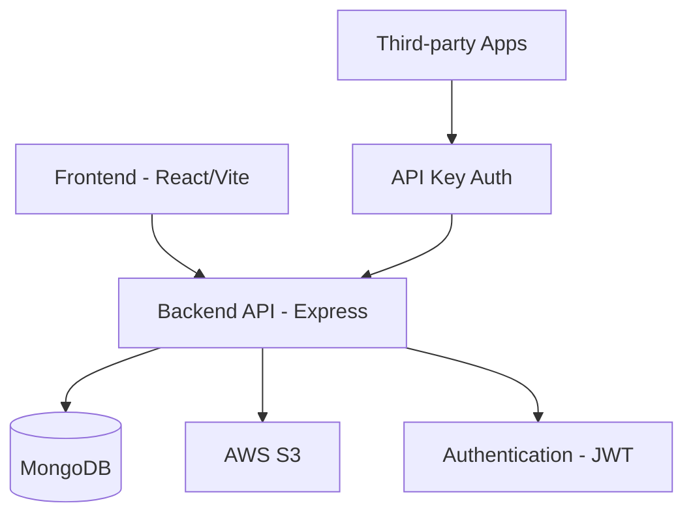

# CloudUpload - File Management Platform

CloudUpload is a modern, full-stack file management platform that allows users to upload, organize, and share files with robust authentication, API key management, and analytics capabilities.

## Table of Contents

- [Features](#features)
- [Technology Stack](#technology-stack)
- [Architecture Overview](#architecture-overview)
- [Getting Started](#getting-started)
  - [Prerequisites](#prerequisites)
  - [Backend Setup](#backend-setup)
  - [Frontend Setup](#frontend-setup)
- [Environment Variables](#environment-variables)
- [API Documentation](#api-documentation)
- [Deployment](#deployment)
- [Project Structure](#project-structure)
- [Security](#security)
- [License](#license)

## Features

### 🔐 Authentication System
- JWT-based user authentication and session management
- Secure password hashing with bcrypt
- Protected routes for authenticated users only

### 📁 File Management
- File upload with size validation (200KB per file, 100MB total storage per user)
- File listing with pagination, search, and sorting
- File download with secure signed URLs
- Bulk file deletion
- AWS S3 integration for scalable storage

### 🔑 API Key Management
- Generate and manage API keys for programmatic access
- Secure API key authentication with SHA-256 hashing
- API key usage tracking and monitoring

### 📊 Analytics & Monitoring
- Storage usage tracking with visual progress indicators
- Upload statistics and trends visualization
- Dashboard with file analytics and usage patterns

### 🌐 Responsive UI
- Modern React 19 frontend with Vite
- Dark/light mode support
- Mobile-responsive design
- Real-time feedback with toast notifications

## Technology Stack

### Frontend
- **React 19** - Latest React features and performance improvements
- **Vite** - Lightning fast build tool
- **TypeScript** - Type-safe development
- **Tailwind CSS** - Utility-first CSS framework
- **shadcn/ui** - Accessible UI components
- **Redux Toolkit** - State management with RTK Query
- **React Router v7** - Client-side routing
- **Zod** - Schema validation

### Backend
- **Node.js** - JavaScript runtime
- **Express 5.x** - Web application framework
- **TypeScript** - Type-safe backend development
- **MongoDB/Mongoose** - NoSQL database
- **AWS S3** - Cloud storage
- **JWT** - Token-based authentication
- **Passport.js** - Authentication middleware
- **Winston** - Logging framework

## Architecture Overview



The application follows a clean, decoupled architecture with separate frontend and backend services that can be independently deployed and scaled.

## Getting Started

### Prerequisites

- Node.js >= 18.x
- MongoDB instance (local or cloud)
- AWS S3 bucket
- npm or yarn package manager

### Backend Setup

1. Navigate to the backend directory:
   ```bash
   cd backend
   ```

2. Install dependencies:
   ```bash
   npm install
   ```

3. Create a `.env` file based on `.env.example`:
   ```bash
   cp .env.example .env
   ```

4. Configure your environment variables (see [Environment Variables](#environment-variables))

5. Start the development server:
   ```bash
   npm run dev
   ```

The backend will start on `http://localhost:8000` by default.

### Frontend Setup

1. Navigate to the frontend directory:
   ```bash
   cd frontend
   ```

2. Install dependencies:
   ```bash
   npm install
   ```

3. Create a `.env` file based on `.env.example`:
   ```bash
   cp .env.example .env
   ```

4. Configure your environment variables (see [Environment Variables](#environment-variables))

5. Start the development server:
   ```bash
   npm run dev
   ```

The frontend will start on `http://localhost:5173` by default.

## Environment Variables

### Backend (.env)

```bash
# Server Configuration
PORT=8000
NODE_ENV=development
LOG_LEVEL=info

# CORS Configuration
ALLOWED_ORIGIN=http://localhost:5173

# Database Configuration
MONGODB_URI=mongodb://localhost:27017/fileupload

# JWT Configuration
JWT_SECRET=your-super-secret-jwt-key
JWT_EXPIRES_IN=1d

# AWS S3 Configuration
AWS_ACCESS_KEY=your-aws-access-key
AWS_SECRET_KEY=your-aws-secret-key
AWS_REGION=your-aws-region
AWS_S3_BUCKET=your-s3-bucket-name
```

### Frontend (.env)

```bash
# API Configuration
VITE_API_BASE_URL=http://localhost:8000

# Application Configuration
VITE_APP_NAME=CloudUpload
VITE_APP_VERSION=1.0.0

# Security Configuration
VITE_REDUX_PERSIST_SECRET_KEY=your-redux-persist-secret

# Feature Flags
VITE_ENABLE_ANALYTICS=true
VITE_ENABLE_DEBUG=true
VITE_ENABLE_DEV_TOOLS=true
```

## API Documentation

The backend API is documented using Swagger. Once the backend is running, you can access the documentation at:
```
http://localhost:8000/api-docs
```

### Key API Endpoints

#### Authentication
- `POST /api/auth/register` - User registration
- `POST /api/auth/login` - User login
- `POST /api/auth/logout` - User logout

#### File Management
- `POST /api/files/upload` - Upload files
- `GET /api/files/all` - List user files
- `POST /api/files/download` - Download files
- `DELETE /api/files/bulk-delete` - Delete files

#### API Keys
- `POST /api/apikey/create` - Create API key
- `GET /api/apikey/all` - List API keys
- `DELETE /api/apikey/delete/:id` - Delete API key

#### Analytics
- `GET /api/analytics/user` - User analytics data

## Deployment

### Backend Deployment

1. Build the backend:
   ```bash
   npm run build
   ```

2. Start the production server:
   ```bash
   npm start
   ```

### Frontend Deployment

1. Build the frontend:
   ```bash
   npm run build
   ```

2. Deploy the `dist` folder to your preferred hosting platform (Vercel, Netlify, etc.)

## Project Structure

### Backend
```
backend/
├── src/
│   ├── config/          # Configuration files
│   ├── controllers/     # Request handlers
│   ├── middlewares/     # Express middleware
│   ├── models/          # Database models
│   ├── routes/          # API routes
│   ├── services/        # Business logic
│   ├── utils/           # Utility functions
│   ├── validators/      # Input validation
│   ├── app.ts           # Express app setup
│   └── server.ts        # Server entry point
├── .env                 # Environment variables
└── package.json         # Dependencies
```

### Frontend
```
frontend/
├── src/
│   ├── app/             # Redux store and API client
│   ├── components/      # Reusable UI components
│   ├── configs/         # Configuration files
│   ├── features/        # Feature modules (auth, files, etc.)
│   ├── hooks/           # Custom React hooks
│   ├── layouts/         # Page layouts
│   ├── lib/             # Utility functions
│   ├── pages/           # Page components
│   ├── routes/          # Routing configuration
│   ├── App.tsx          # Main app component
│   └── main.tsx         # Entry point
├── .env                 # Environment variables
└── package.json         # Dependencies
```

## Security

### Authentication
- Passwords are hashed using bcrypt
- JWT tokens are used for session management
- API keys are securely hashed before storage
- Rate limiting prevents abuse

### Data Protection
- File access is restricted to owners
- Signed URLs provide temporary access to files
- Input validation prevents injection attacks
- CORS policies restrict unauthorized access

### Best Practices
- Environment variables are used for sensitive configuration
- HTTPS should be used in production
- Regular dependency updates to patch vulnerabilities

