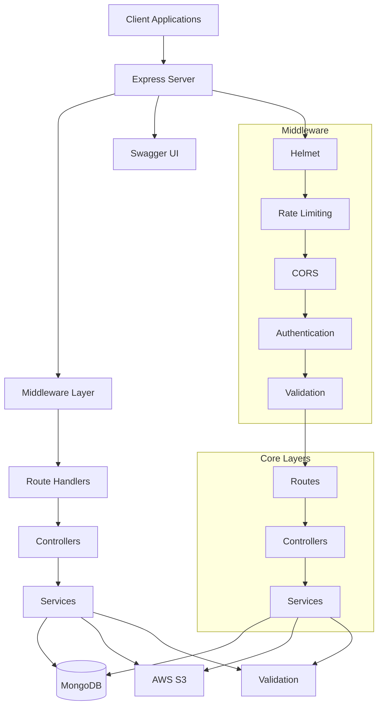

# CloudUpload Backend

CloudUpload Backend is a Node.js/Express application that provides RESTful APIs for file management, user authentication, API key management, and analytics. Built with TypeScript, it uses MongoDB for data storage and AWS S3 for file storage.

## Table of Contents

- [Features](#features)
- [Technology Stack](#technology-stack)
- [Architecture Overview](#architecture-overview)
- [Getting Started](#getting-started)
  - [Prerequisites](#prerequisites)
  - [Installation](#installation)
  - [Development](#development)
- [Environment Variables](#environment-variables)
- [Project Structure](#project-structure)
- [API Documentation](#api-documentation)
- [Authentication](#authentication)
- [File Management](#file-management)
- [API Key Management](#api-key-management)
- [Analytics](#analytics)
- [Security](#security)
- [Error Handling](#error-handling)
- [Logging](#logging)
- [Rate Limiting](#rate-limiting)
- [Building for Production](#building-for-production)
- [Deployment](#deployment)

## Features

### 🔐 Authentication
- JWT-based user authentication and session management
- Secure password hashing with bcrypt
- Protected routes for authenticated users only
- Session persistence and token expiration handling

### 📁 File Management
- File upload with validation and storage in AWS S3
- File listing with pagination, search, and sorting
- File download with secure signed URLs
- Bulk file operations (delete, download)
- Storage quota management (200KB per file, 100MB total per user)

### 🔑 API Key Management
- Generate and manage API keys for programmatic access
- Secure API key authentication with SHA-256 hashing
- API key usage tracking and monitoring
- Key revocation capabilities

### 📊 Analytics
- Storage usage tracking
- Upload statistics and trends
- File analytics with aggregation

### 🛡️ Security
- Rate limiting to prevent abuse
- Helmet.js for HTTP header security
- HPP protection against HTTP parameter pollution
- CORS configuration
- Input validation with Zod

## Technology Stack

- **Node.js** - JavaScript runtime
- **Express 5.x** - Web application framework
- **TypeScript** - Type-safe development
- **MongoDB/Mongoose** - NoSQL database
- **AWS S3** - Cloud storage
- **JWT** - Token-based authentication
- **Passport.js** - Authentication middleware
- **Winston** - Logging framework
- **Zod** - Schema validation

## Architecture Overview



## Getting Started

### Prerequisites

- Node.js >= 18.x
- MongoDB instance (local or cloud)
- AWS S3 bucket
- npm or yarn package manager

### Installation

1. Clone the repository:
   ```bash
   git clone <repository-url>
   ```

2. Navigate to the backend directory:
   ```bash
   cd backend
   ```

3. Install dependencies:
   ```bash
   npm install
   ```

### Development

1. Create a `.env` file based on the required variables (see [Environment Variables](#environment-variables))

2. Start the development server:
   ```bash
   npm run dev
   ```

The server will start on `http://localhost:8000` by default.

## Environment Variables

The application requires several environment variables to be configured. Create a `.env` file in the root of the backend directory.

### Required Variables

```bash
# Server Configuration
PORT=8000
NODE_ENV=development
LOG_LEVEL=info

# CORS Configuration
ALLOWED_ORIGIN=http://localhost:5173

# Database Configuration
MONGODB_URI=mongodb://localhost:27017/fileupload

# JWT Configuration
JWT_SECRET=your-super-secret-jwt-key
JWT_EXPIRES_IN=1d

# AWS S3 Configuration
AWS_ACCESS_KEY=your-aws-access-key
AWS_SECRET_KEY=your-aws-secret-key
AWS_REGION=your-aws-region
AWS_S3_BUCKET=your-s3-bucket-name
```

### Variable Descriptions

| Variable | Default | Description |
|---------|---------|-------------|
| `PORT` | `8000` | Server port |
| `NODE_ENV` | `development` | Environment (development/production) |
| `LOG_LEVEL` | `info` | Logging level |
| `ALLOWED_ORIGIN` | `*` | CORS allowed origins |
| `MONGODB_URI` | `` | MongoDB connection URI |
| `JWT_SECRET` | `secret_jwt` | JWT signing secret |
| `JWT_EXPIRES_IN` | `1d` | JWT expiration time |
| `AWS_ACCESS_KEY` | `` | AWS access key |
| `AWS_SECRET_KEY` | `` | AWS secret key |
| `AWS_REGION` | `us-east-1` | AWS region |
| `AWS_S3_BUCKET` | `` | S3 bucket name |

## Project Structure

```
backend/
├── src/
│   ├── config/          # Configuration files
│   ├── controllers/     # Request handlers
│   ├── middlewares/     # Express middleware
│   ├── models/          # Database models
│   ├── routes/          # API routes
│   ├── services/        # Business logic
│   ├── utils/           # Utility functions
│   ├── validators/      # Input validation
│   ├── app.ts           # Express app setup
│   └── server.ts        # Server entry point
├── .env                 # Environment variables
├── package.json         # Dependencies
└── tsconfig.json        # TypeScript configuration
```

## API Documentation

The backend API is documented using Swagger. Once the server is running, you can access the documentation at:
```
http://localhost:8000/api-docs
```

### Base Path
All API endpoints are prefixed with `/api` by default.

## Authentication

The backend implements dual authentication mechanisms:

### JWT Authentication
Used for web interface authentication:
- Users log in with email/password
- Server returns JWT token
- Client includes token in Authorization header

### API Key Authentication
Used for programmatic access:
- Users generate API keys through the web interface
- Keys follow format: `sk_live_<random-string>`
- Keys are SHA-256 hashed before storage
- Clients include keys in Authorization header

## File Management

### Upload Process
1. Client sends multipart form data with files
2. Middleware validates file size and type
3. Storage quota is checked
4. Files are uploaded to AWS S3
5. Metadata is stored in MongoDB

### Download Process
1. Client requests file download
2. Server validates user ownership
3. Temporary signed URL is generated
4. Client receives URL for direct S3 access

### Storage Limits
- Individual file size: 200KB
- Total storage per user: 100MB

## API Key Management

### Key Generation
- Keys are 48-character random hex strings
- Format: `sk_{type}_{secret}`
- Raw keys are shown only once
- Keys are SHA-256 hashed before storage

### Key Authentication
- Keys are extracted from Authorization header
- Keys are validated against database records
- User context is attached to request
- Last used timestamp is updated

## Analytics

The analytics system provides:
- Storage usage tracking
- Upload trends and statistics
- File analytics with aggregation
- Data visualization endpoints

## Security

### Authentication Security
- Passwords hashed with bcrypt
- JWT tokens with expiration
- API keys SHA-256 hashed
- Rate limiting to prevent abuse

### Data Security
- File access restricted to owners
- Signed URLs for temporary access
- Input validation on all endpoints
- CORS policies restrict unauthorized access

### Transport Security
- Helmet.js for HTTP header security
- HPP protection against parameter pollution
- Rate limiting to prevent DoS attacks

## Error Handling

The backend implements comprehensive error handling:
- Custom error classes for different error types
- Centralized error middleware
- Proper HTTP status codes
- Detailed error messages in development
- Generic messages in production

## Logging

Logging is implemented with Winston:
- Configurable log levels
- Console and file transports
- Structured logging format
- Environment-specific configuration

## Rate Limiting

Rate limiting is implemented with express-rate-limit:
- Global rate limiting (100 requests per 15 minutes)
- Configurable window and limit
- Automatic headers for rate limit information

## Building for Production

To create a production build:

```bash
npm run build
```

This will compile TypeScript files to JavaScript in the `dist/` directory.

## Deployment

### Running in Production

```bash
npm start
```

This will run the compiled JavaScript application.

### Deployment Options

1. **Traditional Hosting**
   - Build the application
   - Deploy to a Node.js hosting provider
   - Configure environment variables

2. **Docker Deployment**
   - Build Docker image
   - Run container with environment variables

3. **Cloud Platforms**
   - Deploy to platforms like Heroku, AWS Elastic Beanstalk, etc.
   - Configure environment variables in the platform dashboard

### Important Notes
- Ensure all environment variables are properly configured
- Use a production MongoDB instance
- Configure proper SSL/TLS for production
- Set `NODE_ENV` to `production`