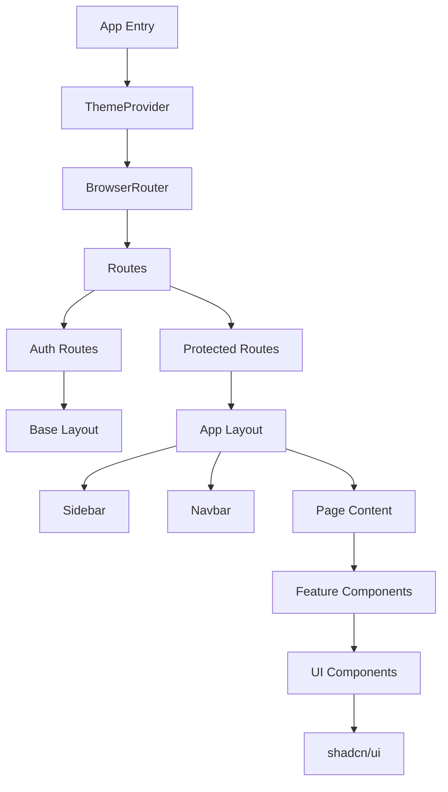

# CloudUpload Frontend

CloudUpload is a modern file management platform built with React 19, Vite, and TypeScript. This frontend application provides a responsive, accessible interface for users to upload, manage, and share files with robust authentication and analytics capabilities.

## Table of Contents

- [Features](#features)
- [Technology Stack](#technology-stack)
- [Architecture Overview](#architecture-overview)
- [Getting Started](#getting-started)
  - [Prerequisites](#prerequisites)
  - [Installation](#installation)
  - [Development](#development)
- [Environment Variables](#environment-variables)
- [Project Structure](#project-structure)
- [State Management](#state-management)
- [Component Architecture](#component-architecture)
- [Routing](#routing)
- [API Integration](#api-integration)
- [Theming](#theming)
- [Development Tools](#development-tools)
- [Building for Production](#building-for-production)
- [Deployment](#deployment)

## Features

### 🔐 Authentication
- User registration and login with JWT
- Protected routes for authenticated users
- Session persistence with Redux Persist
- Token expiration handling

### 📁 File Management
- Drag-and-drop file uploads
- File listing with pagination, search, and sorting
- File download with secure signed URLs
- Bulk file operations (delete, download)
- File type visualization with appropriate icons
- Grid and list view layouts

### 🔑 API Key Management
- Create and manage API keys for programmatic access
- View key metadata (creation date, last used)
- Secure key deletion

### 📊 Analytics Dashboard
- Storage usage visualization with progress indicators
- Upload trends and statistics
- File analytics with interactive charts

### 🎨 User Experience
- Responsive design for all device sizes
- Light/dark mode with system preference detection
- Accessible UI components with proper ARIA attributes
- Real-time feedback with toast notifications
- Loading states and skeleton screens

## Technology Stack

- **React 19** - Latest React features and performance improvements
- **Vite** - Lightning fast build tool with HMR
- **TypeScript** - Type-safe development
- **Tailwind CSS** - Utility-first CSS framework
- **shadcn/ui** - Accessible UI components built with Radix UI
- **React Router v7** - Client-side routing
- **Redux Toolkit** - State management with RTK Query
- **Zod** - Schema validation
- **React Hook Form** - Form handling and validation
- **Recharts** - Data visualization

## Architecture Overview



## Getting Started

### Prerequisites

- Node.js >= 18.x
- npm or yarn package manager
- Backend API running (see backend README)

### Installation

1. Clone the repository:
   ```bash
   git clone <repository-url>
   ```

2. Navigate to the frontend directory:
   ```bash
   cd frontend
   ```

3. Install dependencies:
   ```bash
   npm install
   ```

### Development

1. Create a `.env` file based on `.env.example`:
   ```bash
   cp .env.example .env
   ```

2. Configure your environment variables (see [Environment Variables](#environment-variables))

3. Start the development server:
   ```bash
   npm run dev
   ```

The application will be available at `http://localhost:5173` by default.

## Environment Variables

The application uses Vite's environment variable system. All variables must be prefixed with `VITE_`.

### Required Variables

```bash
# API Configuration
VITE_API_BASE_URL=http://localhost:8000

# Application Configuration
VITE_APP_NAME=CloudUpload
VITE_APP_VERSION=1.0.0

# Security Configuration
VITE_REDUX_PERSIST_SECRET_KEY=your-redux-persist-secret

# Feature Flags
VITE_ENABLE_ANALYTICS=true
VITE_ENABLE_DEBUG=true
VITE_ENABLE_DEV_TOOLS=true
```

### Variable Descriptions

| Variable | Default | Description |
|---------|---------|-------------|
| `VITE_API_BASE_URL` | `http://localhost:8000` | Base URL for the backend API |
| `VITE_APP_NAME` | `FileUpload` | Application name |
| `VITE_APP_VERSION` | `1.0.0` | Application version |
| `VITE_REDUX_PERSIST_SECRET_KEY` | `default-secret-key` | Secret key for Redux Persist encryption |
| `VITE_ENABLE_ANALYTICS` | `true` | Enable analytics tracking |
| `VITE_ENABLE_DEBUG` | `false` | Enable debug console logging |
| `VITE_ENABLE_DEV_TOOLS` | `true` | Enable development tools |

## Project Structure

```
frontend/
├── src/
│   ├── app/                 # Redux store and API client
│   ├── components/          # Reusable UI components
│   ├── configs/             # Configuration files
│   ├── constant/            # Application constants
│   ├── context/             # React context providers
│   ├── features/            # Feature modules
│   │   ├── analytics/       # Analytics feature
│   │   ├── apikeys/         # API key management
│   │   ├── auth/            # Authentication
│   │   └── files/           # File management
│   ├── hooks/               # Custom React hooks
│   ├── layouts/             # Page layouts
│   ├── lib/                 # Utility functions
│   ├── pages/               # Page components
│   ├── routes/              # Routing configuration
│   ├── App.tsx              # Main app component
│   └── main.tsx             # Entry point
├── public/                  # Static assets
├── .env                     # Environment variables
├── .env.example             # Environment variable template
├── ENVIRONMENT.md           # Environment configuration guide
├── components.json          # shadcn/ui configuration
├── tailwind.config.js       # Tailwind CSS configuration
├── tsconfig.json            # TypeScript configuration
├── vite.config.ts           # Vite configuration
└── package.json             # Dependencies
```

## State Management

The application uses Redux Toolkit with RTK Query for state management:

### Core Components

- **Store**: Configured in `src/app/store.ts` with Redux Persist
- **Auth Slice**: Manages authentication state in `src/features/auth/authSlice.ts`
- **API Client**: RTK Query base client in `src/app/api-client.ts`
- **Feature APIs**: Individual API services in each feature directory

### Persistence Strategy

- Authentication state is persisted using Redux Persist
- API cache is excluded from persistence for performance and security
- Encryption is applied to persisted state using the secret key

## Component Architecture

The application follows a component-based architecture with clear separation of concerns:

### UI Components
Located in `src/components/ui/` - Reusable atomic components from shadcn/ui

### Feature Components
Located in `src/components/` - Domain-specific components:
- Data Table: Reusable table with pagination
- File Card: Visual representation of files
- File Uploader: Drag-and-drop file upload
- Upload Layout: Grid/list view switching

### Page Components
Located in `src/pages/` - Feature-specific pages organized by domain

## Routing

The application implements a dual routing system:

### Auth Routes
- `/sign-in` - User login
- `/sign-up` - User registration

### Protected Routes
- `/overview` - Dashboard with analytics
- `/files` - File management
- `/api-keys` - API key management
- `/settings` - User settings
- `/docs` - Documentation

Route protection is handled by `AuthRoute` and `ProtectedRoute` components.

## API Integration

RTK Query is used for all API interactions with automatic caching and revalidation:

### Authentication Endpoints
- `useLoginMutation` - User login
- `useRegisterMutation` - User registration

### File Management Endpoints
- `useUploadFilesMutation` - File upload
- `useGetAllFilesQuery` - File listing
- `useDeleteFilesMutation` - File deletion
- `useDownloadFilesMutation` - File download

### API Key Endpoints
- `useCreateApiKeyMutation` - Create API key
- `useGetAllApikeysQuery` - List API keys
- `useDeleteApiKeyMutation` - Delete API key

### Analytics Endpoints
- `useGetUserAnalyticsWithChartQuery` - User analytics data

## Theming

The application supports light, dark, and system themes using a custom ThemeProvider:

- Theme preference is stored in localStorage
- System preference is detected automatically
- CSS variables are used for consistent styling
- Dark mode uses a grayish color scheme for better readability

## Development Tools

### ESLint Configuration
- TypeScript-aware linting rules
- React-specific rules
- Import sorting and formatting

### TypeScript Configuration
- Strict type checking
- Path aliases for clean imports
- Separate configurations for app and node scripts

### Debugging
- Development-only logging utility
- Environment-based feature flags
- Detailed error messages in development mode

## Building for Production

To create a production build:

```bash
npm run build
```

This will generate optimized assets in the `dist/` directory.

### Build Process
- TypeScript compilation
- Asset optimization
- Code splitting
- Minification

## Deployment

The frontend can be deployed to any static hosting service:

### Vercel
1. Connect your repository
2. Set environment variables in the dashboard
3. Deploy automatically on push

### Manual Deployment
1. Build the application: `npm run build`
2. Deploy the `dist/` directory to your hosting provider
3. Configure environment variables on the hosting platform

### Important Notes
- Ensure `VITE_API_BASE_URL` points to your deployed backend
- Set `VITE_ENABLE_DEBUG` to `false` in production
- Configure proper redirect rules for client-side routing